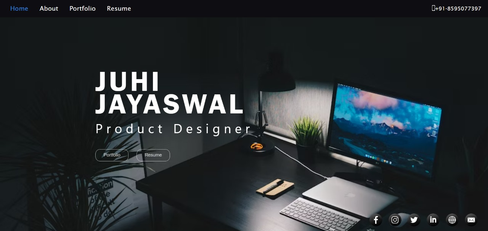
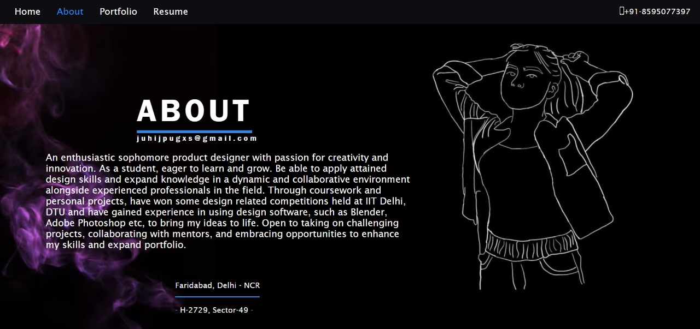
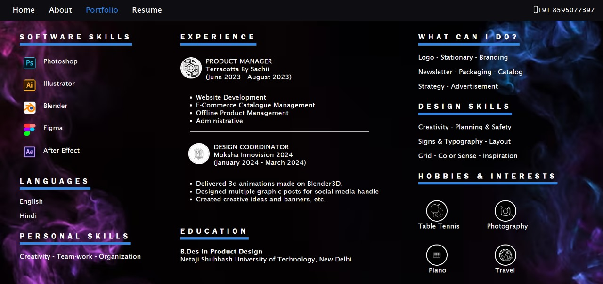

# Design Portfolio Website
Welcome to the awesome design portfolio website! This was my first step into the world of HTML and CSS, crafted with passion and a sprinkle of creativity back in September 2023. It might seem simple now, but it's a project I'm super proud of because it's where my journey began!

## Table of Contents
- [Features](#features)
- [Technologies Used](#technologies-used)
- [Installation](#installation)
- [Usage](#usage)
- [Screenshots](#screenshots)

## Features
- Clean and modern UI
- Portfolio showcasing experience and past works
- About section with biography and skills
- Contact details for inquiries

## Technologies Used
- HTML5
- CSS3

## Installation
To get a local copy up and running, follow these steps:

1. Clone the repository:
    ```bash
    git clone https://github.com/yourusername/portfolio-website.git
    ```

2. Navigate to the project directory:
    ```bash
    cd portfolio-website
    ```

3. Open `main.html` in your browser to view the website.

## Usage
Modify the HTML and CSS files to personalize the website with your content and design. Replace placeholder text and images with your own.

## Screenshots




# Happy Coding! 😊
